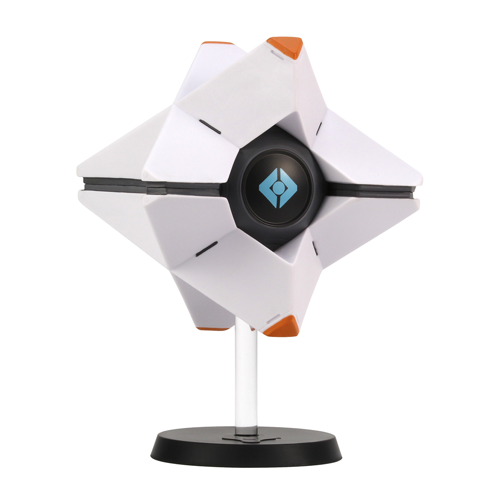

# Destiny 2 Ghost
This is a side project I'm working on to see if I can build the Destiny 2 ghost in real life. My plan is to base the design off of the same technology as self driving cars

I'll be using a quad copter design

See the draw.io file for architecture design

Components:
* Camera
    * computer vision
* Lider
    * spatial awareness
* Speaker
    * attach LLM to recieve input and a give output

* Motors
    * 4 motors to drive movement